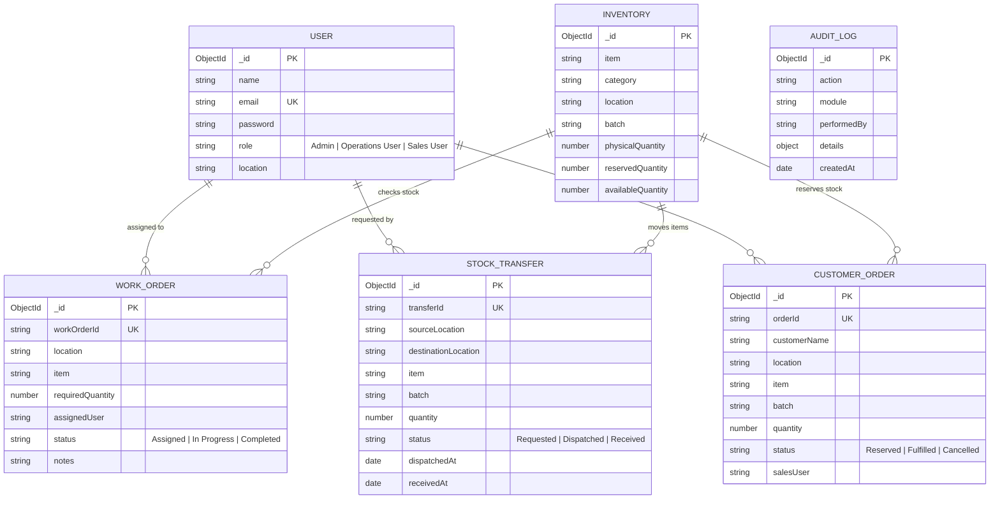

# Mini Operations ERP (MERN Stack)

[](https://nodejs.org/)
[](https://react.dev/)
[](https://expressjs.com/)
[](https://www.mongodb.com/)
[]()

> A production-oriented, full-stack **Mini Operations ERP** built using **MongoDB, Express.js, React.js, and Node.js (MERN)** with a modern **Royal Blue & Clean White** aesthetic. Designed for multi-location inventory, work order shortage calculation, inter-facility stock transfers, and atomic database-level customer order reservations.

---

## 📋 Table of Contents
1. [Core Features & Business Flow](#core-features--business-flow)
2. [Tech Stack](#tech-stack)
3. [Architecture & ER Diagram](#architecture--er-diagram)
4. [Roles & Permissions Matrix](#roles--permissions-matrix)
5. [Project Setup & Installation](#project-setup--installation)
6. [Environment Variables](#environment-variables)
7. [Running the Application](#running-the-application)
8. [Automated Test Suite (Mandatory 5 Tests)](#automated-test-suite)
9. [API Documentation](#api-documentation)
10. [Demo Video Walkthrough (5-7 Minutes Guide)](#demo-video-walkthrough)
11. [Interview Defense & Explanation Guide](#interview-defense--explanation-guide)
12. [Deployment Guide](#deployment-guide)

---

## 🎯 Core Features & Business Flow

The system manages the end-to-end operational lifecycle:
$$\text{Inventory} \longrightarrow \text{Work Order} \longrightarrow \text{Stock Check} \longrightarrow \text{Internal Transfer / Shortage} \longrightarrow \text{Customer Reservation}$$

- **Multi-Location Inventory:** Tracks items across facilities (e.g. *Warehouse Mumbai*, *Plant Pune*, *Delhi Hub*).
- **Correct Stock Formula:** 
  $$\mathbf{Available\ Quantity} = \mathbf{Physical\ Quantity} - \mathbf{Reserved\ Quantity}$$
- **Work Order Material Shortage:** Automatically calculates available stock at plant and detects shortages:
  $$\mathbf{Shortage} = \max(0, \mathbf{Required\ Material} - \mathbf{Available\ Stock})$$
- **Internal Stock Transfer Lifecycle:**
  1. *On Dispatch:* Source inventory is reduced immediately. Destination inventory is **not** modified.
  2. *On Receipt:* Destination inventory increases.
  3. *Double-Receipt Prevention:* An already received transfer cannot be received again.
- **Atomic Customer Order Reservation:** Concurrency race conditions are solved at the database level using atomic conditional updates (`findOneAndUpdate({ availableQuantity: { $gte: qty } }, { $inc: ... })`), preventing over-reservation even if multiple users submit orders simultaneously.
- **Order Cancellation & Stock Release:** Live verification feature allowing reserved stock to be returned cleanly to available inventory.
- **Concurrency Simulation Lab:** Interactive frontend screen to demonstrate parallel requests and prove atomic serialization live to interviewers.

---

## 🛠️ Tech Stack

- **Frontend:** React.js 19, Vite, Lucide Icons, Vanilla Modern CSS (Tailored Royal Blue `#1E40AF` & Crisp White palette).
- **Backend:** Node.js, Express.js (Clean ES Modules `import/export`).
- **Database:** MongoDB with Mongoose ODM (Atomic conditional updates, compound unique indexes).
- **Authentication:** JWT (JSON Web Tokens) with 7-day expiration, bcryptjs password hashing, role-based authorization middleware.
- **Testing:** Jest + Supertest (automated integration tests for all 5 mandatory business rules).
- **Architecture:** Portable, unified production serving (Backend serves React build from `/frontend/dist` on a single port for zero-config deployment).

---

## 📊 Architecture & ER Diagram



---

## 🔐 Roles & Permissions Matrix

| Feature / Action | Admin | Operations User | Sales User |
| :--- | :---: | :---: | :---: |
| **View Inventory & Batches** | ✅ | ✅ | ✅ |
| **Add / Update Inventory Stock** | ✅ | ✅ | ❌ |
| **Create Work Orders** | ✅ | ❌ | ❌ |
| **Update Work Order Status** | ✅ | ✅ | ❌ |
| **Request Internal Stock Transfer** | ✅ | ✅ | ❌ |
| **Dispatch & Receive Transfers** | ✅ | ✅ | ❌ |
| **Create Customer Order & Reserve Stock** | ✅ | ❌ | ✅ |
| **Cancel Order & Release Stock** | ✅ | ❌ | ✅ |
| **Run Concurrency Lab** | ✅ | ✅ | ✅ |
| **View Audit Trail** | ✅ | ✅ | ✅ |

### Default Demo Credentials:
- **Admin:** `admin@erp.com` / `admin123`
- **Operations User:** `ops@erp.com` / `ops123`
- **Sales User:** `sales@erp.com` / `sales123`

*(The UI also includes **1-Click Quick Login Chips** so you can switch roles instantaneously during your interview demo).*

---

## 🚀 Project Setup & Installation

### Prerequisites
- Node.js (v18 or higher)
- MongoDB running locally on port 27017 or a MongoDB Atlas connection string

### 1. Clone & Install
```bash
git clone <your-repo-url>
cd fundsroom2

# Install backend dependencies
cd backend
npm install

# Install frontend dependencies
cd ../frontend
npm install
```

### 2. Environment Variables Setup
In `backend/.env`:
```env
PORT=5000
MONGODB_URL=mongodb://127.0.0.1:27017/mini_operations_erp
JWT_SECRET=erp_super_secret_jwt_key_2026
NODE_ENV=development
```

### 3. Seed Database with Realistic Data
Populate multi-location inventories, users, work orders, and sample transfers:
```bash
cd backend
node seed.js
```

---

## 💻 Running the Application

### Option A: Unified Production Build (Recommended for Demo & Deployment)
Builds the React frontend and serves both API and UI from port `5000`:
```bash
# From workspace root
npm run build
npm start
```
Open **`http://localhost:5000`** in your browser.

### Option B: Local Development Mode (Hot Reload)
Start the backend and frontend development servers concurrently:
```bash
# Terminal 1: Backend
cd backend
npm run dev

# Terminal 2: Frontend
cd frontend
npm run dev
```
- Frontend UI: `http://localhost:5173`
- Backend API: `http://localhost:5000`

---

## 🧪 Automated Test Suite

We implemented an automated test suite verifying all 5 mandatory technical requirements:

```bash
cd backend
npm test
```

### Test Coverage Results:
```text
PASS tests/erp.test.js
  Mini Operations ERP - Mandatory Assignment Tests
    ✓ Test 1: Cannot reserve more than available inventory (143 ms)
    ✓ Test 2: Cannot transfer more than available inventory (69 ms)
    ✓ Test 3: Destination stock increases only after transfer receipt (298 ms)
    ✓ Test 4: Same transfer cannot be received twice (282 ms)
    ✓ Test 5: Unauthorized user cannot perform restricted operation (62 ms)

Test Suites: 1 passed, 1 total
Tests:       5 passed, 5 total
Snapshots:   0 total
Time:        2.3 s
```

---

## 📡 API Documentation

Import the included `postman_collection.json` into Postman, or reference below:

### 1. Authentication
- `POST /api/auth/login` — Sign in and receive JWT token (`{ email, password }`)
- `GET /api/auth/me` — Get current logged-in user profile
- `GET /api/auth/users` — List all users for task assignments

### 2. Inventory Management
- `GET /api/inventory?location=&category=&search=` — Get inventory with summary metrics
- `GET /api/inventory/metadata` — Get distinct locations, items, and categories
- `POST /api/inventory` — *(Admin, Ops)* Add new inventory batch or replenish physical quantity

### 3. Work Orders & Stock Check
- `GET /api/work-orders/check-stock?location=...&item=...&requiredQuantity=...` — Automatically calculates available stock, shortage, and surplus at other plants
- `GET /api/work-orders` — List work orders with optional filtering
- `POST /api/work-orders` — *(Admin Only)* Create new work order
- `PATCH /api/work-orders/:id/status` — *(Admin, Ops)* Update status (`Assigned`, `In Progress`, `Completed`)

### 4. Internal Stock Transfers
- `GET /api/transfers` — List transfer requests
- `POST /api/transfers` — *(Admin, Ops)* Request transfer (validates source available stock)
- `PATCH /api/transfers/:id/dispatch` — *(Admin, Ops)* Dispatch transfer (atomically decreases source stock)
- `PATCH /api/transfers/:id/receive` — *(Admin, Ops)* Receive transfer (increases destination stock; prevents double-receipt)

### 5. Customer Orders & Concurrency
- `GET /api/orders` — List customer orders
- `POST /api/orders` — *(Sales, Admin)* Create customer order and atomically reserve stock
- `PATCH /api/orders/:id/cancel` — *(Sales, Admin)* Cancel order and release reserved stock
- `POST /api/orders/simulate-concurrency` — Simulate parallel reservations to test race condition handling

---

## 🎥 Demo Video Walkthrough (5–7 Minutes)

When recording your video for submission:
1. **0:00 - 0:45 | Login & Role System:** 
   Show the Login screen. Demonstrate the **1-Click Quick Login** chips. Explain Admin, Operations, and Sales roles.
2. **0:45 - 2:00 | Inventory Management:**
   Show the KPI cards. Explain the core formula: `Available = Physical - Reserved`. Demonstrate filtering by location (Mumbai, Pune, Delhi). Add 50 units as an Operations user and show the utilization bar update.
3. **2:00 - 3:15 | Work Order & Material Stock Check:**
   Switch to Admin. Click "Create Work Order". Select *Warehouse Mumbai*, *Steel Rods*, and *100 units*. Show the **Automatic Stock Check Widget**: Available is 70, calculated Shortage is 30! Show how the system suggests that *Plant Pune* has surplus stock and provides a 1-click button to initiate an Internal Transfer.
4. **3:15 - 4:30 | Internal Stock Transfer Flow:**
   Switch to Operations. Open Transfers. Show the transfer for 30 units.
   - Click **Dispatch Transfer**: Highlight that source stock at Pune decreased immediately, while destination at Mumbai did **not** increase yet!
   - Click **Receive Transfer**: Show that destination stock at Mumbai now increases.
   - Click receive again or show that the button is locked to prove **duplicate receipt is prevented**.
5. **4:30 - 5:45 | Customer Order & Stock Reservation:**
   Switch to Sales User. Create an order for 60 units. Show that reserved stock increments by 60 and available decreases by 60. Then click **"Cancel & Release Stock"** to demonstrate that cancelled orders return reserved units back to available stock.
6. **5:45 - 6:30 | Concurrency Lab & Automated Tests:**
   Open the **Concurrency Lab** tab. Click **"Execute Simultaneous Concurrent Requests"** with User A (80 units) and User B (50 units) on 100 available stock. Show that User A succeeds and User B is rejected. Conclude by running `npm test` in the terminal to display all 5 passing tests.

---

## 💡 Interview Defense & Explanation Guide

During technical interviews, you will likely be asked to explain your design decisions. Here are exact explanations:

### 1. How did you solve the concurrency issue when two users reserve stock at the same time?
> *"We solved race conditions at the database level without requiring heavy external distributed locks by utilizing MongoDB's **atomic conditional update** (`findOneAndUpdate`). We pass `availableQuantity: { $gte: requestedQuantity }` in the query predicate and `$inc: { reservedQuantity: qty, availableQuantity: -qty }` in the update. Since MongoDB executes document-level write operations atomically and in serialized order, even if User A and User B make simultaneous requests within the same millisecond, MongoDB serializes them. The first request decrements the available stock; when the second request executes, the available stock no longer satisfies the `$gte` condition. The query matches 0 documents and returns `null`, cleanly returning an HTTP 400 error."*

### 2. How did you handle the rule: "On dispatch source reduces, before receipt destination must not increase"?
> *"In `dispatchTransfer`, we decrement the source inventory's physical and available quantity atomically and set the transfer status to `Dispatched`. The destination inventory is intentionally left completely untouched. Only when `receiveTransfer` is called does the destination stock increase. Furthermore, we use an atomic condition `{ _id, status: 'Dispatched' }` when marking it `Received`. If someone attempts to receive the transfer a second time, the status is already `Received`, matching 0 records and preventing double receipts."*

### 3. Answers to the 4 "Live Verification" Interview Scenarios:
- **Scenario 1: Add Damaged Stock?**
  *Add `damagedQuantity` field to `Inventory`. Update available formula to `availableQuantity = physicalQuantity - reservedQuantity - damagedQuantity`.*
- **Scenario 2: Allow partial transfer receipt?**
  *Add `receivedQuantity` to `StockTransfer`. When receiving, accept `receivedQty <= transfer.quantity`. If `receivedQty < quantity`, mark status as `Partially Received` and increase destination stock by `receivedQty`.*
- **Scenario 3: Cancel an order and release reserved inventory?**
  *Already implemented in our project! Route: `PATCH /api/orders/:id/cancel` performs `$inc: { reservedQuantity: -order.quantity, availableQuantity: order.quantity }` and marks order status `Cancelled`.*
- **Scenario 4: Restrict users to only their assigned location?**
  *In the `protect` middleware or route handlers, add a check: `if (req.user.role !== 'Admin' && req.user.location !== targetLocation) return res.status(403).json({ message: 'Forbidden: Access restricted to assigned location' })`.*

---

## 🌐 Deployment Guide (Render / Railway / Vercel)

This application is container-ready and portable:

1. **MongoDB Atlas:** Create a free cluster at [mongodb.com/atlas](https://www.mongodb.com/atlas) and obtain your connection string `mongodb+srv://...`.
2. **Deploy on Render / Railway:**
   - Connect your GitHub repository.
   - Build Command: `npm run build`
   - Start Command: `npm start`
   - Environment Variables:
     - `PORT=5000`
     - `MONGODB_URL=<your-mongodb-atlas-url>`
     - `JWT_SECRET=<your-secret-key>`
     - `NODE_ENV=production`
3. Click **Deploy**! The backend will serve the API and the React production build from a single URL.
